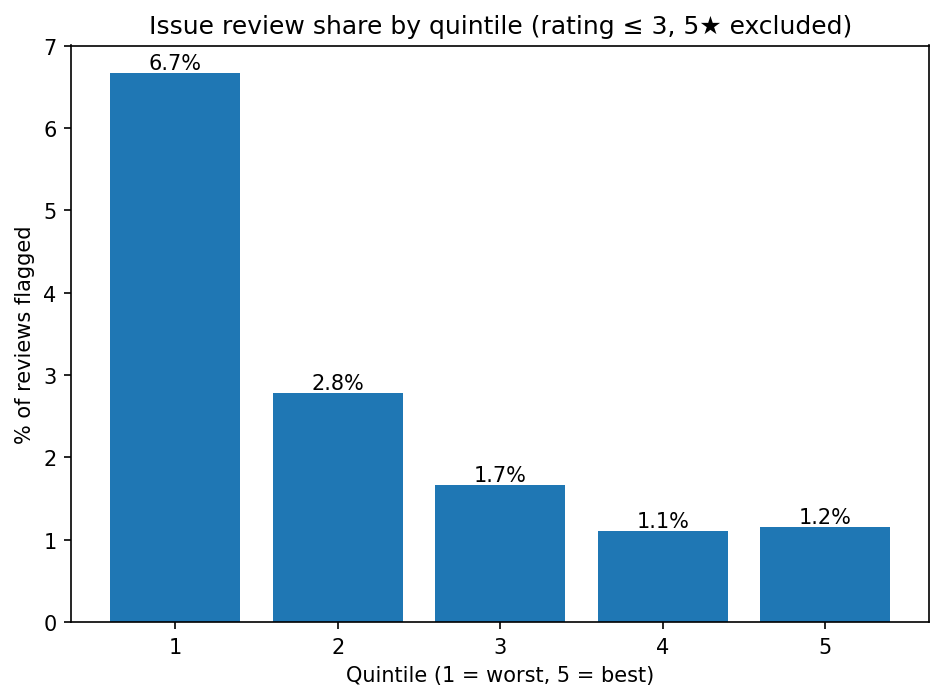

# Beserva India Analysis

This project is inspired by my good friend and fellow NYU alum, **Maria**, who founded [Beserva](https://www.beserva.com/) — a Mexico City–based startup building a **WhatsApp-integrated LLM bot** for salons and beauty parlors.  
Beserva’s product helps small businesses manage **appointments, scheduling, and cancellations**, reducing missed bookings due to admin problems. It’s especially impactful in markets where **WhatsApp is the dominant communication channel**.

---

## Project Goal

The goal of this project is two-fold:

1. **Market relevance in India**  
   Can we prove that India — and specifically Mumbai — faces scheduling/admin problems that Beserva can solve?  

2. **Impact on businesses**  
   Can we show, using data, how deep these problems are and whether they disproportionately affect **lower-rated businesses** compared to higher-rated ones?

---

## Data Collection

Data was collected using the **Google Places API**.  
- I scraped reviews from **360 businesses in Mumbai**, identified through the following queries:

"beauty salon in Mumbai",
"hair salon in Mumbai",
"spa in Mumbai",
"makeup studio in Mumbai",
"beauty parlour in mumbai",
"hairdresser in mumbai",
"barbershop in mumbai",
"nail salon in mumbai",
"pedicure in mumbai",
"manicure in mumbai",
"nail salon in Mumbai"

- For each business, the API provides **up to 5 “most relevant” reviews**.  
  This is a **limitation of the free API** — in practice, one can obtain **all reviews for all places** through advanced pipelines or third-party datasets (likely paid).  
- Despite this limitation, the dataset still provides **1,000+ reviews** with enough signal to analyze scheduling/admin issues in Mumbai’s salon ecosystem.

How to expand coverage (more places + more reviews):

A) Get more places than the ~60/query cap (official & compliant)
Use Google Places Nearby Search on a city grid instead of Text Search:

Generate a grid of lat/lng points across Mumbai.

For each point, call nearbysearch with a radius (e.g., 2–3 km) and relevant types.

Collect place_ids and dedupe.

B) Get more reviews per place (beyond the 5 “most relevant”)
Google’s official Place Details caps at ~5 reviews. To fetch full review histories (and/or newest-first), use SerpAPI’s Google Maps Reviews endpoint (paid after free credits).

Sign up at serpapi.com, set SERPAPI_API_KEY

Result: hundreds/thousands of reviews per salon, ordered by newest if desired.

---

## How we flagged “Beserva-relevant” issues in reviews

To connect our analysis to the core problem Beserva solves, we flagged reviews that mentioned **appointments, scheduling, cancellations, delays, or WhatsApp coordination**.

The logic was:

1. **Normalize the text**  
   - Lowercased all review text and filled blanks so keyword checks are consistent.

2. **Collect signals from multiple flags**  
   - We pulled together any of the following signals (if present in the dataset):  
     - **Appointment/Booking/Schedule** → `is_appt_issue`, `is_booking_issue`, `kw_appointment`, `kw_booking`, `kw_schedule`  
     - **Cancellations / No-shows** → `kw_cancel`, `kw_no_show`  
     - **Timing / Delays / Wait time** → `is_timing_issue`, `kw_wait_delay`  
     - **WhatsApp coordination** → `kw_whatsapp`  
   - If *any* of these flags were present, the review was marked as a **potential issue**.

3. **Only count issues when the rating was bad**  
   - We defined an **effective issue** as:  
     > Review contains an appointment/booking/timing/WhatsApp keyword **AND** its star rating is ≤ 3★.  
   - This excluded 4★ and 5★ reviews to avoid misclassifying positive experiences like *“My appointment was great.”*

4. **Why this matters**  
   - This ensured we only captured **admin/scheduling complaints that customers were unhappy about**, not just casual mentions.  
   - It gave us a clean basis to compare **best-rated vs worst-rated businesses** on the prevalence of meaningful admin problems.

> **In short:** we combined all relevant appointment/admin keywords into one, but only counted them as issues if the review’s star rating was low. This keeps the focus squarely on problems Beserva is designed to solve.

---

## Quintile Analysis: Do admin issues drag down ratings?

Once we flagged the reviews for **Beserva-relevant issues**, we asked:

- Do these problems appear **more often** in low-rated salons than in high-rated ones?  
- Could these admin issues (missed appointments, poor scheduling, miscommunication) be **dragging down ratings** even if the actual beauty service is good?

To test this, we:

1. Pulled each salon’s **overall Google rating** from the API.
2. Sorted all salons by rating and split them into **five equal quintiles**:  
   - **Q1 = worst-rated 20%**  
   - **Q5 = best-rated 20%**  
3. For each quintile, we counted:  
   - Total number of reviews  
   - Number of reviews flagged with effective Beserva-issues (low-star + admin problem)  
   - Percentage of reviews that were issue-related

This allowed us to directly compare whether **lower-rated businesses suffer more from appointment/admin complaints**.

